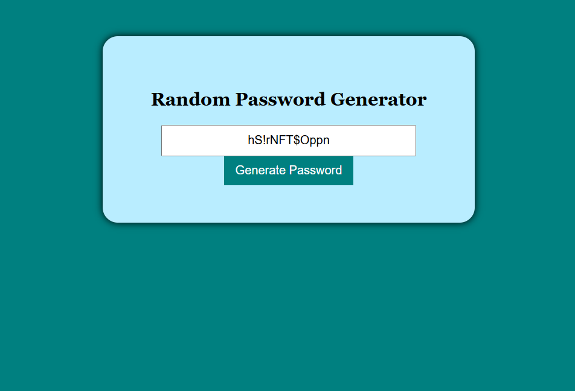

# random-password-generator

A simple password generator built with HTML, CSS, and JavaScript.

## Features
- Generates a random password with uppercase, lowercase, numbers and symmbols.
-Simple UI with a button to generate random password.

## How to Use
1. Open 'index.html' in your browser.
2. CLick the 'Generate Password' button.
3. Copy the generated password and use it.

## Preview

## Technlogies Used
- HTML
- CSS
- JavaScript

## Installation
1. Clone the repository:
git clone https://github.com/your-username/random-password-generator.git
2. Open 'index.html' in a browser.